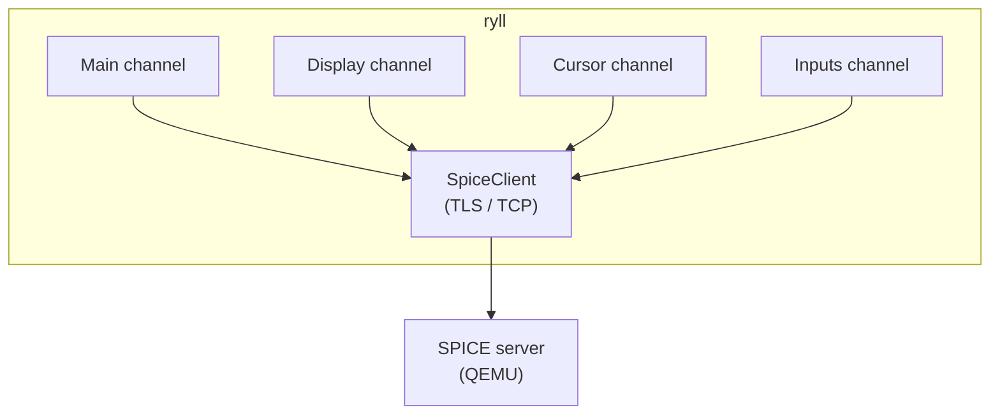
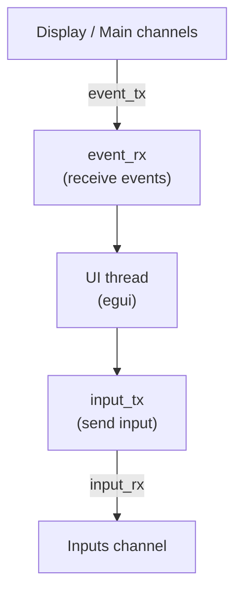

# Architecture

This document is the map of ryll: what the crates are, how they fit
together, and where the concurrency boundaries lie. Subsystem detail lives
in `docs/`, indexed below.

## Where the detail lives

| Topic | Document |
|-------|----------|
| Channel model, handshake, image encodings, display capabilities, scancodes | [`docs/spice-protocol.md`](docs/spice-protocol.md) |
| Surface compositing, window sizing, multi-monitor, audio playback, notifications | [`docs/rendering-pipeline.md`](docs/rendering-pipeline.md) |
| USB redirection, WebDAV folder sharing, paste-as-keystrokes | [`docs/device-redirection.md`](docs/device-redirection.md) |
| Traffic capture, statistics, ring buffer, snapshots, bug reports | [`docs/diagnostics.md`](docs/diagnostics.md) |
| Reconnection and graceful shutdown | [`docs/session-lifecycle.md`](docs/session-lifecycle.md) |
| Encoder, WebRTC bridge, `--web` relays and lifecycle | [`docs/web-mode-internals.md`](docs/web-mode-internals.md) |
| Running `--web` as an operator | [`docs/web-frontend.md`](docs/web-frontend.md) |
| CLI options, `.vv` format, environment variables | [`docs/configuration.md`](docs/configuration.md) |
| Building, testing, the local QEMU test server | [`docs/development.md`](docs/development.md) |
| Feature parity across the three modes | [`docs/multi-mode-parity.md`](docs/multi-mode-parity.md) |

## Repository layout

The repository is a Cargo workspace with **6 crates**:

| Crate | Role |
|-------|------|
| `ryll` | The binary: egui GUI, headless runner, CLI, Ctrl+C, trait impls for host-side concerns (capture, notifications, clipboard, USB devices, WebDAV server) |
| `shakenfist-spice-protocol` | Protocol constants, message framing, link handshake and auth for both the client and server/proxy roles, the `BoundedReader` for panic-free parsing of untrusted input, warn-once gap registry. Fuzz targets for the internet-facing parsers live in `shakenfist-spice-protocol/fuzz/` (a detached workspace, run under nightly `cargo fuzz`) |
| `shakenfist-spice-compression` | GLZ/LZ/LZ4 + QUIC decompression, shared (byte-bounded) GLZ dictionary (cross-channel), per-platform JPEG decoder selector (ImageIO / WIC / VA-API / libjpeg-turbo / pure-Rust fallback), MJPEG + H.264 video decoder traits |
| `shakenfist-spice-usbredir` | usbredir wire-format parser and message types |
| `shakenfist-spice-renderer` | SPICE substrate shared by all frontends: channels, display surface, encoder pipeline, session orchestrator, trait surface for host-side concerns |
| `shakenfist-spice-webrtc` | WebRTC bridge: wraps an `Arc<dyn PeerConnection>` with a video track, audio track, and control datachannel; consumes `EncodedFrame`s from the renderer's encoder |

When invoking cargo from the workspace root, use `-p ryll` to
target the ryll package (e.g. `cargo build -p ryll`,
`cargo deb --no-build -p ryll`) or `--workspace` to act on
every member (e.g. `cargo test --workspace`).

## Overview

Ryll is a SPICE (Simple Protocol for Independent Computing Environments) client
implemented in Rust. It connects to SPICE servers (typically QEMU virtual machines)
and displays their framebuffer, while sending keyboard and mouse input.

Ryll is designed as a **multi-modal SPICE client**: the
SPICE protocol stack, channel handlers, decompression, audio
pipeline, and display surface compositing are all frontend-
agnostic, and each delivery mode is a thin layer over that
shared core. The supported modes are:

| Mode | Frontend | Primary use |
|------|----------|-------------|
| GUI | egui / eframe desktop window | Interactive day-to-day VDI access from the operator's own machine |
| Headless | none (stdout + metrics) | Automated testing, CI, cadence latency probing, scripted USB / WebDAV scenarios |
| Web | Browser via WebRTC | Interactive VDI access from any browser on the LAN |

All three modes ship. A feature is not considered complete when it
works in only one mode: every feature should be reachable from every
mode that can physically support it, and intrinsic mode-specific
features (egui-only UI panels, browser-only clipboard APIs) should be
documented as such so the parity gaps are visible. The current gap
list is in `docs/multi-mode-parity.md`.



## Crate boundaries

The SPICE substrate (channel handlers, display surface, encoder,
session orchestrator) lives in `shakenfist-spice-renderer`, which is
intentionally **egui-free**: no `eframe` or `egui` types appear in its
source. That is what lets the GUI, headless and `--web` modes share the
substrate without each frontend dragging in the others' dependencies.

`shakenfist-spice-webrtc` is separate again, because the webrtc-rs
dependency tree (DTLS, SRTP, ICE, SCTP, STUN) is heavy and not every
consumer of the substrate needs it.

### Communication upward: ChannelEvent

Channel handlers communicate state changes upstream via the
`ChannelEvent` enum (variants for surface lifecycle, image
arrivals, latency samples, notifications, etc.). Producers send
on `mpsc::Sender<ChannelEvent>`; the frontend (GUI event loop or
headless runner) drains the receiver and reacts.

### Trait surface for host-side concerns

Some channel concerns are long-lived sinks that need to be
injected at construction time rather than emitted as events:

| Trait | Defined in | Implemented in `ryll/src/` | Purpose |
|-------|-----------|---------------------------|---------|
| `TrafficSink` | `shakenfist-spice-renderer` | `bugreport::TrafficBuffers` | Per-channel raw-byte ring buffer for bug-report traffic capture and the live traffic viewer |
| `CaptureSink` | `shakenfist-spice-renderer` | `capture::CaptureSession` | pcap + MP4 frame recording; also has a no-op stub when the `capture` feature is disabled |
| `NotificationSink` | `shakenfist-spice-renderer` | `notifications::NotificationStoreSink` | Pushes `NotificationEntry` values into the in-app notification store |
| `ClipboardBackend` | `shakenfist-spice-renderer` | `clipboard_arboard` | Host clipboard read/write via `arboard` |
| `UsbDeviceBackend` | `shakenfist-spice-renderer` | usbredir channel constructor; `RealDevice` / `VirtualMsc` concrete types live in the renderer's `usb/` directory | USB host-side device attachment |
| `WebdavBackend` | `shakenfist-spice-renderer` | webdav channel constructor; `MuxDemuxer` + `WebdavServer` live in the renderer's `webdav/` directory | WebDAV directory share lifecycle |
| `OpusPacketSink` | `shakenfist-spice-renderer` | `web::audio::WebOpusSink` | Pre-decode Opus tap on the playback channel for WebRTC passthrough |

**When to use `ChannelEvent` vs a trait**: prefer a
`ChannelEvent` variant when the concern is event-shaped
(a one-shot notification, a surface lifecycle signal, a latency
sample). Prefer a trait when the concern is a long-lived sink
that the channel writes to continuously (traffic recording,
capture frames). This distinction keeps the event channel
lightweight and the trait surface minimal.

`LogConfig` is passed by value into channel constructors to
carry protocol-logging gates (primarily the verbose flag) without
the channels reaching back into global settings state.

## Code organisation

```
ryll/src/
├── main.rs              # CLI entry, mode selection, Ctrl+C handler
├── app.rs               # egui App, event loop, GUI panels, headless
│                        #   runner, reconnect, egui trait impls
├── auto_snapshot.rs     # --auto-snapshot-interval background task,
│                        #   rolling auto-snapshots/ directory + cap
├── bugreport.rs         # Traffic ring buffer (TrafficBuffers,
│                        #   implements TrafficSink), bug-report ZIP
│                        #   assembly, write_disconnect / DisconnectCause
├── capture.rs           # Pcap + MP4 capture (CaptureSession,
│                        #   implements CaptureSink)
├── clipboard_arboard.rs # Host clipboard (implements ClipboardBackend)
├── config.rs            # CLI args, .vv parsing
├── display_gui.rs       # GuiSurface: egui TextureHandle wrapper
│                        #   around DisplaySurface
├── input_egui.rs        # egui::Key → LogicalKey adapter
├── notifications.rs     # NotificationStore + NotificationStoreSink
├── settings.rs          # is_verbose() gate
├── streaming_state.rs   # Derived state for the streaming status-bar
│                        #   indicator and the flap heuristic
└── web/                 # --web mode
    ├── mod.rs           # run_web() entry, EncoderInfra stop helper
    ├── server.rs        # WebState, axum router, TLS config, bind/serve
    ├── signalling.rs    # POST /offer handler, per-viewer encoder +
    │                    #   bridge lifecycle
    ├── assets.rs        # Embedded browser shell, {{TOKEN}} substitution
    ├── audio.rs         # WebOpusSink (implements OpusPacketSink)
    ├── control.rs       # Server → browser control messages, the
    │                    #   outbound queue the relays feed, and the
    │                    #   writer task that drains it onto the bridge
    ├── cursor.rs        # Cursor relay → control datachannel
    ├── inputs.rs        # Input relay ← control datachannel, plus the
    │                    #   mouse-mode tracker that chooses between
    │                    #   absolute and relative pointer messages
    └── lifecycle.rs     # run_bridge_reaper: waits on the dead
                         #   signal or a bridge replacement, reaps
                         #   bridge + encoder once the bridge it
                         #   holds is confirmed dead

shakenfist-spice-renderer/src/
├── channels/            # Per-channel handlers
│   ├── main_channel.rs  # Session negotiation, ping/pong
│   ├── display.rs       # Display, GLZ dictionary, draw-op decode
│   ├── cursor.rs        # Cursor tracking
│   ├── inputs.rs        # Keyboard/mouse, paste-as-keystrokes,
│   │                    #   LogicalKey enum, scancode tables
│   ├── playback.rs      # Audio (PCM/Opus → rtrb → cpal)
│   ├── usbredir.rs      # USB redirection (SpiceVMC)
│   └── webdav.rs        # WebDAV sharing (SpiceVMC)
├── control/             # Headless control socket (see
│   │                    #   docs/control-socket-protocol.md)
│   ├── mod.rs           # Re-exports: Server, StatusProvider
│   ├── protocol.rs      # Request/Response/Event wire types
│   └── server.rs        # Server::run: bind, accept, dispatch verbs
├── display/
│   └── surface.rs       # DisplaySurface pixel buffer + draw-op API
├── encoder/
│   ├── mod.rs           # Re-exports
│   ├── frame_source.rs  # FrameSource trait, FrameRef, SyntheticFrameSource
│   ├── h264.rs          # H264Encoder, EncodedFrame
│   └── task.rs          # EncoderTask, EncoderControl
├── surface_mirror.rs    # SurfaceMirror: egui-free surface state for --web
├── audio_sink.rs        # OpusPacketSink trait (pre-decode playback tap)
├── usb/                 # USB device backends (RealDevice, VirtualMsc)
├── webdav/              # WebDAV mux + embedded server
├── session.rs           # run_connection, run_headless orchestrators
├── capture_sink.rs      # CaptureSink trait
├── clipboard.rs         # ClipboardBackend trait
├── device_config.rs     # Virtual-disk / shared-directory config shapes
│                        #   passed to the usbredir and webdav channels
├── digest.rs            # Visual-digest QR poller (digest-decode feature)
├── image_cache.rs       # BoundedImageCache: byte-bounded LRU
├── metrics.rs           # Process/thread CPU, memory and uptime sampling
│                        #   for bug reports
├── mm_clock.rs          # Shared monotonic SPICE mm_time clock
├── notification.rs      # NotificationEntry, NotificationSource
├── notification_sink.rs # NotificationSink trait
├── traffic.rs           # TrafficSink trait
├── log_config.rs        # LogConfig value type
├── snapshots.rs         # Channel-state snapshot types
└── byte_counter.rs      # ByteCounter

shakenfist-spice-webrtc/src/
├── bridge.rs            # WebrtcBridge, WebrtcBridgeConfig, BridgeEvents
│                        #   + BridgeHandler (the 0.20
│                        #   PeerConnectionEventHandler impl);
│                        #   wait_for_dead() — resolves when the peer
│                        #   goes away; a local close() usually does
│                        #   not raise it — and dead_signal()
├── bind_addrs.rs        # UdpBindPolicy: which addresses and port to
│                        #   bind for PeerConnectionBuilder
│                        #   ::with_udp_addrs. Default is every
│                        #   non-loopback host address, ephemeral
│                        #   port; --web-media-addr / --web-media-port
│                        #   narrow it
├── sticky.rs            # StickySignal (Notify + sticky AtomicBool)
└── test_client.rs       # TestPeer client-side PC for tests
                         #   (`test-support` feature)
```

## Concurrency model

Ryll uses **tokio async tasks** for concurrency, with **mpsc channels** for
communication between tasks.

### Tasks

| Task | Responsibility |
|------|----------------|
| Main channel | Session negotiation, ping/pong, channel discovery |
| Display channel | Receive images, decompress, queue for rendering |
| Cursor channel | Track cursor position and visibility |
| Inputs channel | Send keyboard/mouse events to server |
| Usbredir channel | USB redirection via SpiceVMC data transport |
| Playback channel | Decode audio, push samples to ring buffer |
| Audio thread | Consume ring buffer, resample, write to cpal device |
| UI thread | egui rendering, input capture (GUI mode only) |
| Repaint bridge | Wait on `Arc<Notify>`; call `egui::Context::request_repaint()` when channel handlers signal a state change. GUI mode only. |

### Channel communication



- **event_tx/event_rx**: Channel handlers send events (images, cursor pos, stats)
  to the UI thread. Each `event_tx.send()` is paired with a
  `repaint_notify.notify_one()` on a shared `Arc<tokio::sync::Notify>`,
  which a small bridge task forwards to `egui::Context::request_repaint()`.
  This lets egui sleep when nothing is happening rather than polling
  at 60 Hz; idle CPU drops by an order of magnitude on systems without
  GPU acceleration. A 1 Hz `request_repaint_after` fallback covers
  time-based UI elements (sparkline ticks, status-message expiry).
- **input_tx/input_rx**: UI thread sends input events (keys, mouse) to the
  inputs channel handler. The channel is bounded (256 slots). The consumer
  coalesces consecutive MouseMove events into a single position update (or
  accumulates MouseMotion deltas) to prevent the channel from filling
  during network stalls, which would cause the producer's `try_send` to
  silently drop critical button events. Mouse events are dispatched based
  on the server's current mouse mode (SERVER → relative MOUSE_MOTION,
  CLIENT → absolute MOUSE_POSITION). See "Mouse-Mode Negotiation" in
  `docs/spice-protocol.md` for the full negotiation flow including the
  post-reboot recovery path.

### TCP keepalive

All channel sockets enable TCP keepalive to match spice-gtk: 30 s idle
before the first probe, then 3 probes at 15 s intervals (75 s total to
detect a dead peer).  This prevents NAT/firewall idle timeouts from
silently breaking channel connections, which is especially important for
secondary channels that can be idle for extended periods (the SPICE
server only pings them every 300 s).
